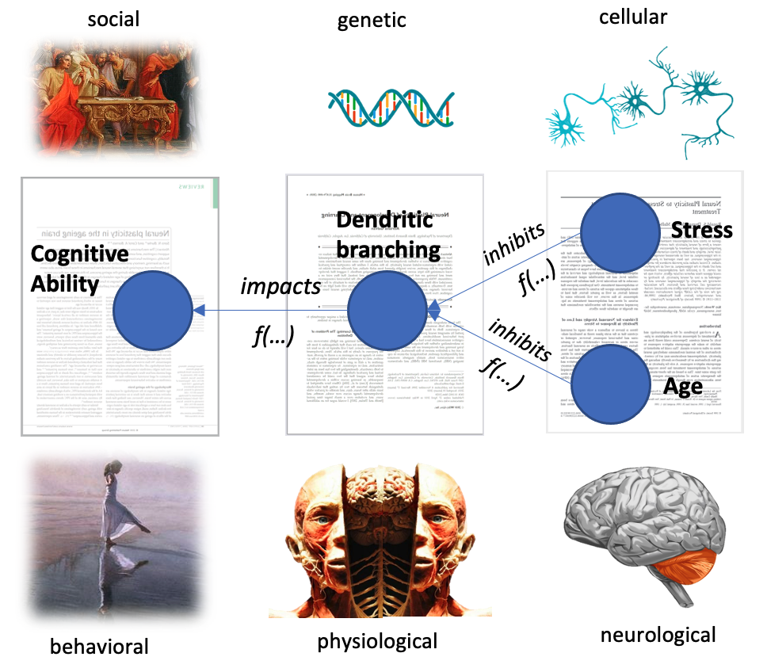
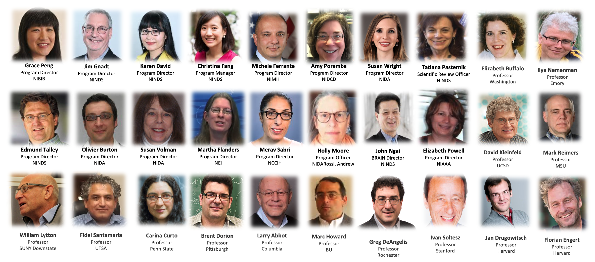

# BRAIN initiative Workspace to Organize the Knowledge Space (BRAINWORKS) 

**Author:** [Dr. Mohammad Ghassemi](https://ghassemi.xyz), National Scholar, Data and Technology Advancement, National Institutes of Health


## Overview


<figure align = "center"><figcaption align = "center"><b>Fig.1 - An illustrative depicition of BRAINWORK's objective - to structure the scientific literature as an integrated knowledge graph</b></figcaption></figure>

<br>**The Need:** The scientific knowledge landscape is vast, complex and rapidly expanding. In 2020, an additional 2 million new peer-reviewed papers were added to the scientific literature, which is now [estimated to contain over 60 million works](https://duncan.hull.name/2010/07/15/fifty-million/). At this volume, it would take a single individual almost 20 years (without breaks) to perform a 5-minute review of each paper written in 2020. Even narrow subdomains of scientific investigation now produce a level of output that is intractable for a single scholar to master: [over 100,000 papers about the coronavirus pandemic were published in 2020](https://www.nature.com/articles/d41586-020-03564-y), alone. 

**The Solution:** As knowledge generation continues to outpace the ability of individual scientists to consume and integrate it, there is a critical need for technology tools that can organize, integrate, and represent the nuanced knowledge contained within the growing body of the scientific literature. [BRAINWORKS](http://brainworks.scigami.org) is a web platform that addresses these needs by structuring the scientific literature as a dynamic and interactive knowledge graph. While development of the platform is ongoing, an alpha version of the tool is freely available online at http://brainworks.scigami.org. 

**The Innovation:** [BRAINWORKS](http://brainworks.scigami.org) is innovative because of its ability to represent scientific knowledge *as well as the context governing its creation* (funding, grants, authors, etc.). Furthermore, it provides a novel way to visualize the temporal evolution of scientific knowledge. 


## Technology Stack

The technology stack for [BRAINWORKS](http://brainworks.scigami.org) consists of three layers. Each layer was designed to function independently to maximize extensions of the technology stack for other use cases.  In brief, the technology stack consists of: 

1. **[An Information layer](documentation/Information-layer.md)**: that collects and stores publicly available publication, grant, and meta-data in a centralized database. This layer enables several potential downstream applications including:

   •   Normalization of citation volumes by publication time and domain

   •  Organization of scientific publications in a structured, searchable knowledge base

   •  Association of non-scientific factors (e.g. grants and author) with publication content

   

2. **[An Algorithms layer](documentation/algorithms-layer.md)**:  that parses the unstructured publication text into structured [semantic triples](https://en.wikipedia.org/wiki/Semantic_triple) and also identifies [UMLS entities](https://www.nlm.nih.gov/research/umls/index.html) that occur within the triples. This layer enables several potential downstream applications including:

   •    Prediction of intervention impact (e.g., grants, or new papers) on knowledge graph structure

   •    Prediction of prospective knowledge graph structure via historical graph dynamics

   •    Identification and mapping of scientific entities in free text to established ontologies (e.g. UMLS)  

   

3. **[A visualization layer](documentation/visualization-layer.md)**:  that represents a set of semantic triples, and meta data as a dynamic and interactive knowledge graph. This layer enables several potential downstream applications including:

   •    Visualization of the evolution of scientific topics and topics-relations over time

   •    Representation and exploration of hierarchical or other complex knowledge relationships 


## Getting started

For ease of extension, we have included several iPython tutorial notebooks that illustrate how to use each component of the technology stack for data collection, natural language analysis, and data visualization, in general. The tutorials also include a few illustrative examples of the analyses that can be performed using the data. 

Here are the steps you need to get started:

1. On an Ubuntu 20.04 machine (or equivalent), run `./setup.sh` 
2. Update the [configuration file](configuration/) with API keys, and database location.
3. Go through [the tutorials](tutorials/). 


## Other Resources:

**Slides** For more details on the BRAINWORK development approach,  see these [slides](documentation/Slides.pdf).

**Complete Data:** An AWS RDS database snapshot containing the entirety of the collected data is available upon request. Please [contact us](mailto:ghassemi@alum.mit.edu) with a brief description of your interest and your AWS account ID. 


## Acknowledgements

The Development of [BRAINWORKS](http://brainworks.scigami.org) was led by [Dr. Mohammad Ghassemi](mailto:ghassem3@msu.edu), 2021 Data and Technology National Service Scholar. Dr. Ghassemi worked in close collaboration with several members of BRAIN Initiative [Team E](https://braininitiative.nih.gov/about/contact-us) including [Dr. Grace Peng](mailto:penggr@mail.nih.gov), [Dr. Jim Gnadt](gnadtjw@ninds.nih.gov), [Dr. Michele Ferrante](mailto:michele.ferrante@nih.gov), [Dr. Susan Wright](mailto:susan.wright@nih.gov), [Dr. Karen David](mailto:karen.david@nih.gov), [Dr. Christina Fang](mailto:christina.fang@nih.gov) and the Director of the BRAIN Initiative, [Dr. John Ngai](mailto:john.ngai@nih.gov). 

We would like to acknowledge the many scientists and NIH partners that generously agreed to participate in [interviews that guided the initial development of the platform](documentation/Neuroscience-PI-Interview-Notes.pdf), the NIH ODSS, and the NIH BRAIN Initiative for supporting this work.

<figure align = "center"><figcaption align = "center"><b>Fig.2 - Names, images and affiliations of those who assisted with the vision of the BRAINWORKS platform.</b></figcaption></figure>


## How to Cite

If you use  [BRAINWORKS](http://brainworks.scigami.org), or a part of this repository as part of your own work, please show us your support by staring and **citing this repository**:

```
@misc{Ghassemi2021BRAINWORKS,
  author = {Ghassemi, Mohammad Mahdi and Peng, Grace and Gnadt, Jim and Ferrante, Michele and Wright, Susan and David, Karen and Fang, Christina and Ngai, John},
  title = {BRAIN initiative Workspace to ORganize the Knowledge Space},
  year = {2021},
  publisher = {GitHub},
  journal = {GitHub repository},
  howpublished = {\url{https://github.com/deskool/brainworks}}
}
```
