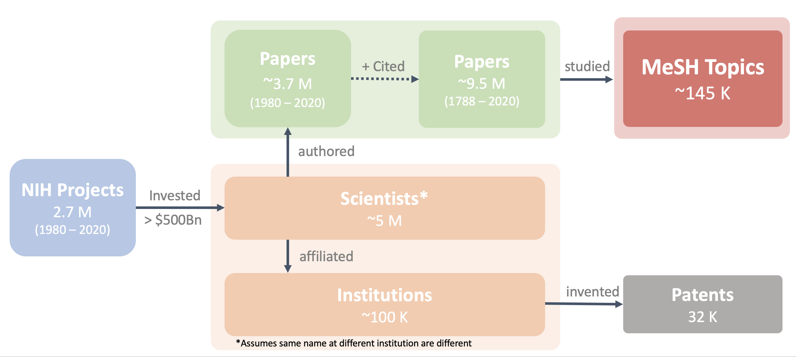

# BRAINWORKS

## Information Layer

<figure align = "center"><figcaption align = "center"><b>Fig.3 - An illustrative overview of the data collected using the information layer of BRAINWORKS.</b></figcaption></figure>

  

The Information layer of BRAINWORKS collects, processes, and stores publication data and meta-data from several publicly available data sources into a read-optimized [MySQL Relational Database](https://www.mysql.com/) for downstream use and analysis. Below we provide a list of the specific data sources collected by the information layer, the specific code utilities written for their processing:

### PubMed

The [PubMed](https://pubmed.ncbi.nlm.nih.gov/) data comprises more than 33 million citations for biomedical literature from MEDLINE, life science journals, and online books. Citations may include links to full text content from PubMed Central and publisher web sites. Our [Pubmed data collection utility](../utils/documentCollector/pubmed.py)  contains several methods that enable:

* Programmatic search and download of the PubMed archive based on search terms, grant ids, or other parameters.
* Parsing of heterogeneous PubMed XML documents into unified highly structured objects for storage in relational tables.
* Application of NLP and other algorithms at the point of download and ingestion including author affiliation parsing.
* Automatic generation of MySQL tables and supporting indices for read-optimized storage of collected data.
* Collection of all papers related to a set of papers (i.e. all papers that cite a set of papers).

### ExPORTER

The [ExPORTER](https://exporter.nih.gov/) data provides access to NIH-funded research projects and their affiliated publications and patents. Our [ExPORTER data collection utility](../utils/documentCollector/exporter.py) contains several methods that enable:

* Parsing of heterogeneous .CSV files into unified structured objects for storage in relational tables.
* Automatic generation of MySQL tables and supporting indices for read-optimized storage of collected data.

### GRID

[GRID](https://www.grid.ac/) is a free and openly available global database of research-related organizations, cataloging research-related organizations and providing each with a unique and persistent identifier.Our [GRID data collection utility](../utils/documentCollector/grid.py) contains several methods that enable:

* Parsing of .CSV files into unified structured objects for storage in relational tables.
* Automatic generation of MySQL tables and supporting indices for read-optimized storage of collected data.

