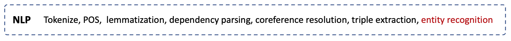

# BRAINWORKS

## Algorithms Layer

 

<figure align = "center"><figcaption align = "center"><b>Fig.4 - The Natural Language Processing (NLP) pipeline used by BRAINWORKS to transform unstructured free text into UMLS annotated triples.</b></figcaption></figure>

 

 

The Algorithms layer of BRAINWORKS transforms unstructured free text data (including, but not limited to, the data collected by the [information layer](Information-layer.md)) into [UMLS](https://www.nlm.nih.gov/research/umls/index.html) annotated [semantic triples](https://en.wikipedia.org/wiki/Semantic_triple). Following extraction, these semantic triples are stored in a read-optimized [MySQL Relational Database](https://www.mysql.com/). Below we discuss the pre-processing and information extraction pipelines of the algorithms layer:

### Preprocessing

The text preprocessing pipeline standardizes and cleanses the text for downstream information extraction (i.e. semantic triples) and entity recognition. Our [Text2graph utility](../utils/text2Graph/text2Graph.py) builds on [Stanford's CORENLP Tool](https://stanfordnlp.github.io/CoreNLP/) to accomplish the following text pre-processing components:

* **Tokenization:** the separation of the text into smaller units called tokens; the tokens can be words, characters, or subwords. 
* **Parts of Speech tagging:** the annotation of each token in the text with a particular part of speech (noun, verb, adjective, etc.), based on both its definition and its context.
* **Lemmatization:** the simplification of tokens to their root words.
* **Dependency Parsing:** the analysis of the sentence grammatical structure to identify semantic dependencies between tokens.
* **Coreference resolution:** the identification and mapping of all expressions that refer to the same entity in a text. 

### Information Extraction

The information extraction (IE) pipeline in our [Text2graph utility](../utils/text2Graph/text2Graph.py)  transforms preprocessed text, into semantic triples with each element of the triple (subject, relation, object) mapped to one or more UMLS entries. The IE pipeline consists of three steps:

* **Triple candidate generation:** we apply [Stanford's OpenIE Tool](https://nlp.stanford.edu/software/openie.html) to extract a large set of semantic triple candidates. 
* **Named Entity Recognition:** we identify and annotate any existing UMLS entities in the extracted triple candidate using a [SciBERT Transformer](https://allenai.github.io/scispacy/). 
* **Minimal spanning set:**  Finally, we retain the minimal spanning set of triples; that is, the smallest possible subset of the triples that captures all UMLS relationships implied by the larger set. 

In this way, each triple reflects the relationships espoused by the original text, as well as the UMLS entities contained within them.

## Usage Considerations

**Parallel Computing:** The information extraction pipeline is computationally intensive. For practical use, we suggest [deployment of the IE pipeline on a parallel computing cluster](../cluster). 

**Modifications:** The NLP pipeline is highly configurable. You can adjust components of this pipeline with relative ease by adjusting the [platform configuration](../configuration) parameters, below:

* `config['NLP']['coreferenceResolution']` :
  References a model from this [Public NLP Models](https://storage.googleapis.com/allennlp-public-models/) repository.
* `config['NLP']['getEntities']` :
  References a model from [Sci Spacy Models](https://allenai.github.io/scispacy/) repository.
* `config['NLP']['informationExtraction']`  
  * Contains [OpenIE options](https://stanfordnlp.github.io/CoreNLP/openie.html) configuration.
  * Contains [CoreNLPClient](https://stanfordnlp.github.io/stanfordnlp/corenlp_client.html) configuration.