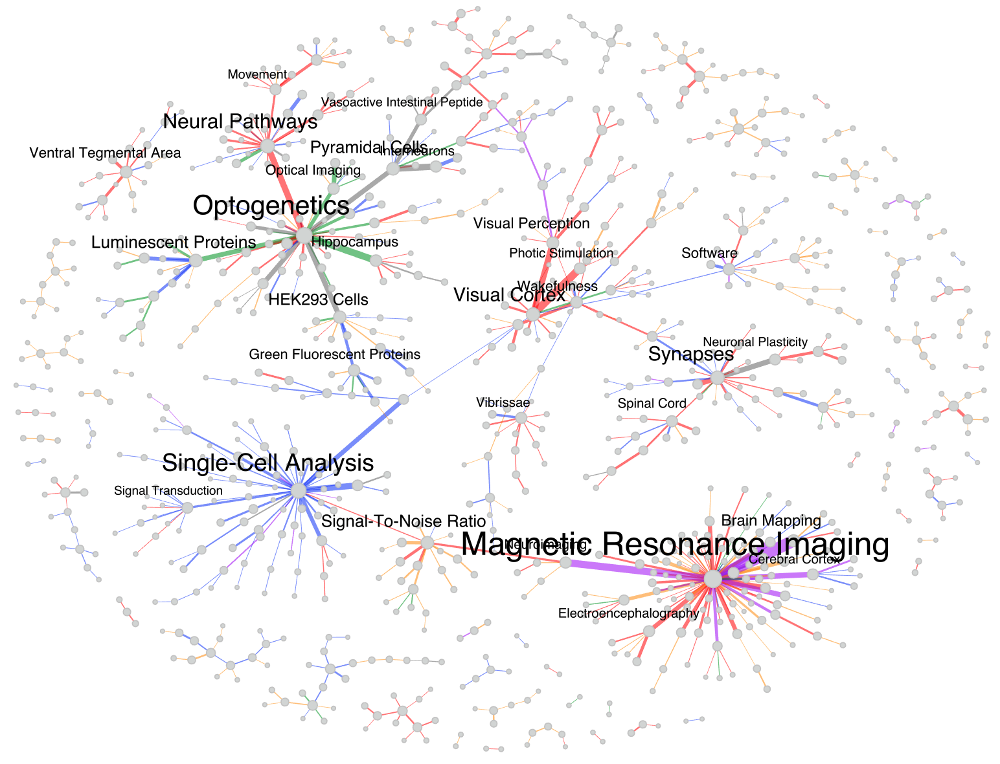

# BRAINWORKS

## Visualization Layer

<hr> 

<figure align = "center"><figcaption align = "center"><b>Fig.5 - A vizualization of Medical Subject Heading (MeSH) topics identified within papers funded by the brain initiative between 2014 and 2020. Nodes represent topics, edges represent topic co-occurances.</b></figcaption></figure>

<br>

<br>

The Visualization layer of BRAINWORKS is an API that takes JSON-formatted graph data (including, but not limited to, the [semantic triples](https://en.wikipedia.org/wiki/Semantic_triple) extracted by the [Algorithms layer](algorithms-layer.md)), and returns a URL where an interactive version of the graph data can be viewed. Our live instantiation of the BRAINWORKS tool uses this API and can be [found online](http://brainworks.scigami.org); and contains an interactive guide through the visualization features. The tool can also be deployed for other applications using the graph API directly, or by [hosting your own graph API](../graph-webapp). Below we discuss the core components of the visualization layer:


### Graph Data Object

The visualization layer extends [Sigma.js](https://www.sigmajs.org/); consequently, it assumes that graph data will be formatted as a JSON object that follows the same structural conventions as Sigma; this includes a `graph` section (where node and edge information is stored), as well as a `config` section (where other properties of the visualization are specified). An example graph data object follows:

```json
{
  "graph": {
    "nodes": [
      {
        "key": "node_1",
        "attributes": {
          "x": -5,
          "y": 0,
          "label": "Node 1",
          "data": {
            "some_number": 1,
            "some_string": "category 1"
          }
        }
      },
      {
        "key": "node_2",
        "attributes": {
          "x": 0,
          "y": 7,
          "label": "Node 2",
          "data": {
            "some_number": 2,
            "some_string": "category 2"
          }
        }
      },
      {
        "key": "node_3",
        "attributes": {
          "x": 5,
          "y": 0,
          "label": "Node 3",
          "data": {
            "some_number": 3,
            "some_string": "category 3"
          }
        }
      }
  ],
  "edges": [
      {
        "key": "1-2",
        "source": "node_1",
        "target": "node_2",
        "attributes": {
          "label": "Edge 1 -> 2",
          "type": "arrow",
          "data": {
            "some_number": 1,
            "some_string": "category 1"
          }
        }
      },
      {
        "key": "2-3",
        "source": "node_2",
        "target": "node_3",
        "attributes": {
          "label": "Edge 2 -> 3",
          "type": "arrow",
          "data": {
            "some_number": 2,
            "some_string": "category 2"
          }
        }
      },
      {
        "key": "3-1",
        "source": "node_3",
        "target": "node_1",
        "attributes": {
          "label": "Edge 3 -> 1",
          "type": "arrow",
          "data": {
            "some_number": 3,
            "some_string": "category 3"
          }
        }
      }
    ]
  },
  "config": {
    "maps": [
      {"dimension": "node_size", "data": "some_number", "args": {"min": 10, "max": 50}},
      {"dimension": "node_color", "data": "some_string", "args": {"category 1": "#FF000000", "category 2": "#00FF00", "category 3": "#0000FF"}},
      {"dimension": "edge_size", "data": "some_number", "args": {"min": 5, "max": 20}},
      {"dimension": "edge_color", "data": "some_string", "args": {"category 1": "#FFFF00", "category 2": "#00FFFF", "category 3": "#FF00FF"}},
      {"dimension": "node_slider", "data": "some_number", "args": "Node Number Slider"},
      {"dimension": "edge_slider", "data": "some_string", "args": "Edge Category Slider"}
    ]
  }
}
```


### Graph API

The graph API takes a graph data object (as shown above) and returns a URL where visualization of the graph data can be accessed. To generate a graph URL, send a GET request to `http://graph.scigami.org:5000/create_graph`, along with the graph data object . The response will be a complete URL to the resulting graph page, which will be valid for a short period of time. 

##### Example GET request to API made in python:

```python
graph_url = requests.get("http://graph.scigami.org:5000/create_graph", json=json_data).content.decode()
```


### Visualization

The URL generated by the Graph API can be navigated to directly, or displayed in an HTML iframe. A sample webpage is shown below where `{{graph_url}}` represents the URL returned by the API.

```html
<!DOCTYPE html>
<html lang="en">
<head>
    <meta charset="UTF-8">
    <title>Example Webpage</title>
</head>
<body>
    <iframe src="{{graph_url}}" title="Graph Iframe" style="width: 90vw; height: 90vh; margin: 4vh 4vw;"></iframe>
</body>
</html>
```

